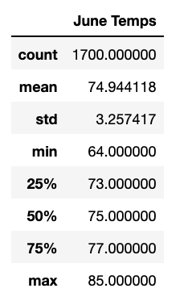
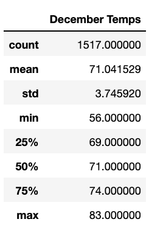

# surfs_up

## Overview
A potential investor in a surf shop would like to see some weather analysis as part of his due diligence. Specifically he has requested to see a summary of temperature data for the months of June and December in Oahu to understand if the business is sustainable all year. 

## Results
### Deliverable 1: Temperatures in June

- The minimum temperature in June historically is 64 degrees
- The maximum temperature in June historically is 85 degrees
- The average temperature in June historically is 75 degrees with 75% of temperatures falling between 73 and 77 degrees


- The minimum temperature in December historically is 56 degrees
- The maximum temperature in December historically is 83 degrees
- The average temperature in December historically is 71 degrees with 75% of temperatures falling between 69 and 74 degrees.

## Summary
According to the temperature data, both June and December would be good months for surfing with the majority of data showing temperatures in the 70s. Some days in December might be a little too cold but only 25% of the data showed temperatures in the 60s or below. 

Some additional insight might be gained by the following analysis:
1. Has the number of days below 70 been increasing or decreasing over the years? Which would require querying the data year by year:
```
december_2010_query = session.query(Measurement.date, Measurement.tobs).filter(extract('month', Measurement.date)==12).filter(extract('year', Measurement.date)==2010)
```
2. What percentage of days in June and December is it either raining or below 70 degrees? Which would require querying data where the temperature is below 70 or the precipitation is above 0:
```
december_bad_days_query = session.query(Measurement.date, Measurement.tobs, Measurement.prcp).filter(extract('month', Measurement.date)==12).filter(or_(Measurement.prcp > 0.0,Measurement.tobs < 70))

```